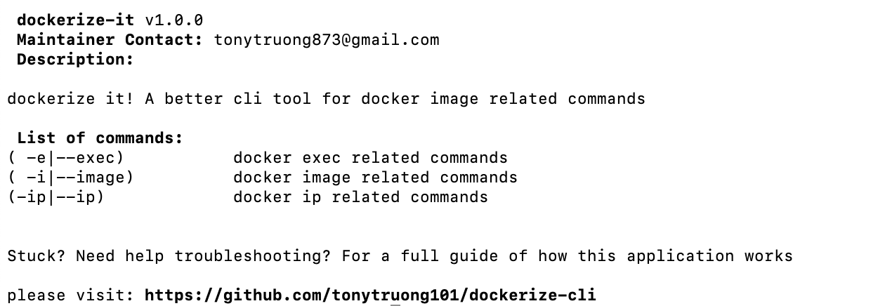
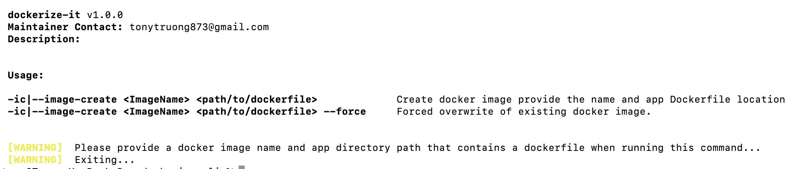
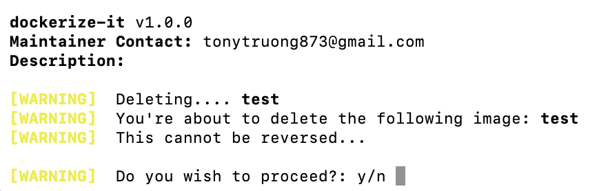

# dockerize-cli

## Introduction

Hate deleting an image or overwriting an existing image with the default docker image command? 
Use `dockerize-it` simple bash tool that invokes the `docker image` command with adding in basic validators to check for pre-existing images.

What about having to remember if its `psql` , `bash` `bin/sh` you have to pass into `docker exec`?

How about discovering different docker container server ip addresses quickly? 

I created this simple bash cli tool that wraps basic `docker` related commands with adding in basic validators, filtering and better output 
to prevent any user errors from occurring. 

## Changelog

Nov 9 2022
Added:

- New Generate Dockerfile feature. 

Includes custom built tech stacks that are easily interchangeable. Not really a reason besides quick easy way to generate Dockerfiles in a new environment
without having to lookup repos, articles or whatever else run a simple command to download a ready to go Dockerfile.

## Command Overview

## Image create / delete Validation Image

This is a personal project feel free to fork and use or tailor to your own needs.

## Setup

Simply clone this repository to your local and run `sh dockerize-it` or `./dockerize-it`

exporting this to your `$PATH` will remove the need to prefix the command with `sh dockerize-it` or `./dockerize-it` 

